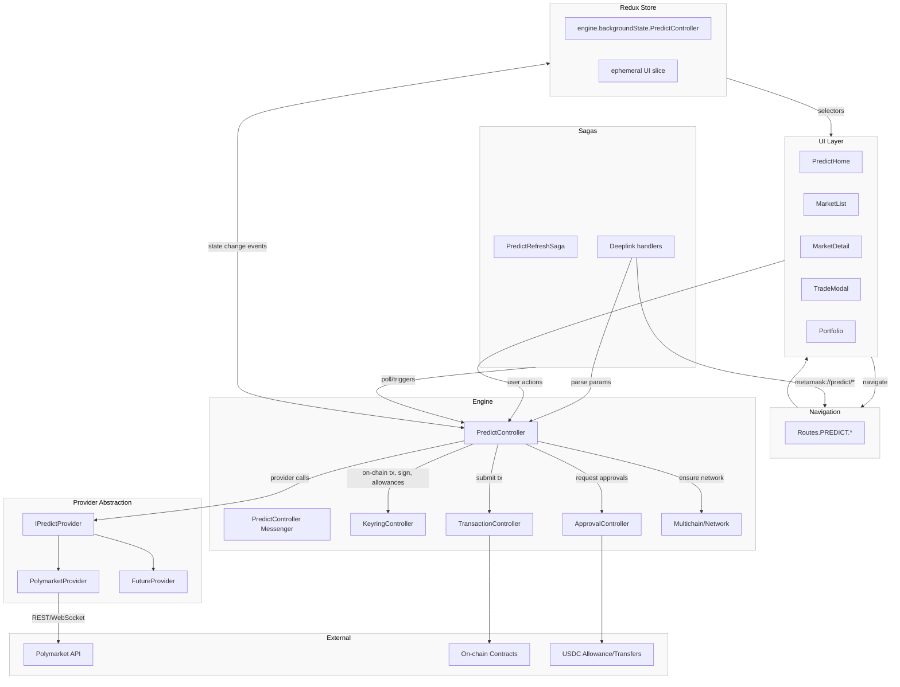

## Prediction Markets Architecture (Draft)

This document proposes a modular architecture to integrate prediction markets (e.g., Polymarket) into MetaMask Mobile. It aligns with existing app patterns (Engine controllers, Redux background state, sagas, navigation, design system UI) and is designed to scale to multiple providers behind a common interface.

### Goals

- Abstract provider differences behind a single controller (`PredictController`) and a provider interface (`IPredictProvider`).
- Support read (markets, prices, positions) and write (approve, buy, sell/redeem) flows across providers.
- Reuse Engine infra for on-chain transactions, approvals, and multichain routing.
- DS-compliant UI with clear navigation flows; easy to add new providers later.

### High-level Overview



### Engine and Controller Layer

- PredictController (Engine)
  - Responsibilities:
    - Provider registry and active provider selection (by market/provider or user preference).
    - Fetch markets, market details, quotes/orderbooks, user positions, balances, exposures, PnL.
    - On-chain: ensure correct network, allowance checks (e.g., USDC), build/simulate/submit trades, track receipts, update background state.
    - Risk/config: min/max order size, slippage, fee calculation, KYC/geo gates as required by provider.
    - Background polling and push updates (prices, odds, fills) via provider capabilities.
    - Persist Engine background state; emit state change events to Redux (like other controllers).

- Controller Init + Messenger
  - File: `app/core/Engine/controllers/predict/predict-controller-init.ts` (new)
  - Add to `initModularizedControllers` in `app/core/Engine/Engine.ts` and to `Engine.context`.
  - Background state change event must be listed for Redux propagation.
  - Messenger surface (examples):
    - `fetchMarkets(filters)` / `fetchMarket(marketId)`
    - `fetchUserPortfolio(address)`
    - `getQuotes(marketId, side, size)`
    - `placeOrder(orderParams)` / `cancelOrder(orderId)` (if supported)
    - `approveSpending(token)` / `checkAllowance(token)`
    - `setActiveProvider(providerId)` / `listProviders()`

### Provider Abstraction

- Interface: `IPredictProvider` (file: `app/core/Engine/providers/predict/types.ts`)

```ts
export interface ProviderCapabilities {
  id: string;
  label: string;
  networks: string[]; // e.g., ['polygon']
  baseCurrency: string; // e.g., 'USDC'
  supportsOrderbook: boolean;
  supportsAMM: boolean;
}

export interface IPredictProvider {
  getCapabilities(): ProviderCapabilities;
  listMarkets(params: MarketFilters): Promise<MarketSummaryPage>;
  getMarket(id: string): Promise<Market>;
  getQuote(input: QuoteInput): Promise<Quote> | Promise<Orderbook>; // depending on supportsOrderbook
  getUserPortfolio(address: string): Promise<Portfolio>;
  getRequiredApprovals(address: string, trade: TradeRequest): Promise<ApprovalRequirement[]>;
  prepareTrade(trade: TradeRequest): Promise<UnsignedTx[]>; // and ancillary pre/post steps
  parseReceipt(tx: TxReceipt): Promise<TradeResult>;
  // optional streaming
  subscribePrices?(marketIds: string[], onUpdate: (u: PriceUpdate) => void): Unsubscribe;
}
```

- First implementation: `PolymarketProvider` (REST/WebSocket + on-chain on Polygon; USDC approvals).
- Provider registry maps `providerId → instance`. Controller selects provider per-market or by user default.

### Data Model

- Engine background state (persisted under `engine.backgroundState.PredictController`):
  - `marketsById: { [marketId]: Market }`
  - `marketSummaries: Paged<MarketSummary>` with last filters
  - `userPortfolioByAddress: { [address]: Portfolio }`
  - `quotesByMarket: { [marketId]: Quote | Orderbook }`
  - `providerConfig: { activeProviderId: string, endpoints?: Record<string,string> }`
  - `pollingStatus: { [resource]: { lastUpdated: number; error?: string } }`

- Core types (illustrative):

```ts
type Market = {
  id: string;
  question: string;
  outcomes: { id: string; label: string }[];
  providerId: string;
  network: string; // chainId or key
  status: 'open' | 'paused' | 'resolved';
  resolution?: { outcomeId: string; time: number };
  decimals: number;
};

type Quote = { price: string; size: string; side: 'buy' | 'sell'; feeBps: number; slippage?: number };
type Orderbook = { bids: Quote[]; asks: Quote[] };

type TradeRequest = {
  marketId: string;
  outcomeId: string;
  side: 'buy' | 'sell';
  size: string; // base size (shares)
  limitPrice?: string; // if orderbook
  slippageBps?: number;
  providerId?: string; // overrides active
};

type TradeResult = { txHash: string; effectivePrice: string; filledSize: string; feePaid: string; status: 'confirmed' | 'failed' };
```

### On-chain Flow Integration

- Use `KeyringController` for signing and `TransactionController` for sending.
- Use `ApprovalController` patterns for token allowances (e.g., USDC approve before trade).
- Ensure correct network via existing network controllers; prompt chain switch if required.
- Optional: simulate tx or dry-run checks before submission where feasible.

### Sagas and Background Jobs

- `PredictRefreshSaga`
  - Poll markets and quotes for visible markets; backoff on failures.
  - Subscribe to provider WebSocket price feeds when available.
  - Throttle portfolio refresh post-trade until confirmed.

- Deeplinks
  - Extend deeplink parser to support: `metamask://predict?market=<id>&side=buy&size=...`
  - Route to Predict screens and pre-fill trade modal.

### Navigation and UI

- Navigation (`Routes.PREDICT` stack):
  - `PredictHome` (provider selector, featured markets)
  - `MarketList` (filters, search)
  - `MarketDetail` (chart/odds, depth if orderbook, outcome details)
  - `TradeModal` (buy/sell with slippage, approvals flow)
  - `Portfolio` (positions, history)

- UI Guidelines
  - Follow `@metamask/design-system-react-native` and Tailwind preset:
    - Use `Box`, `Text`, `Button`, `useTailwind`, DS color tokens.
    - Avoid `StyleSheet.create`, raw `View/Text`, arbitrary colors.

### Security, Compliance, Risk

- Region/KYC gates
  - Provider exposes policy metadata; UI gates or blocks actions accordingly.

- Limits and validation
  - Enforce provider min/max order size, fee bounds, slippage; validate balances and allowances.
  - Handle price movement between quote and confirmation; retry or require user confirm.

### Telemetry

- Track view/interaction/trade events via existing metrics infra:
  - Market view, quote requested, approval requested/completed, trade submitted/confirmed/failed.

### Extensibility

- Adding a provider
  - Implement `IPredictProvider` methods.
  - Register in provider registry; add metadata and network requirements.
  - Capability-driven UI adapts (orderbook vs AMM) without bespoke screens.

### Work Breakdown (Initial Phases)

1) Foundations
   - Define `IPredictProvider` types and registry.
   - Scaffold `PredictController` with background state, messenger, and Engine wiring.

2) Polymarket v1
   - Provider impl: markets, detail, quotes, positions.
   - USDC approvals and trade flow (Polygon).
   - WebSocket/stream or polling for price updates.
   - Error handling and retries.

3) UI & Navigation
   - Add `Routes.PREDICT` stack and basic screens.
   - DS-compliant components: MarketCard, OutcomeRow, TradeForm, ApprovalBanner.

4) Sagas & Deeplinks
   - Background refresh loops and deeplink support.

5) QA & Hardening
   - Unit tests for controller/provider/selectors.
   - Integration tests for approvals, network switching, trade paths.
   - Edge cases: price movement, partial fills, caching/pagination.

### Open Decisions

- Quote currency/chain defaults: USDC on Polygon initially (Polymarket), later expand chain map.
- Provider selection strategy: per-market providerId vs user default; cross-provider market list order.
- Price authority: provider APIs vs on-chain; support both where needed.

### References

- Existing patterns: Engine controller init, messenger wiring, background state → Redux, sagas (`app/store/sagas/index.ts`), and DS UI rules.
- For structural inspiration, see Perps modules (no code reuse assumed but similar layering): `app/components/UI/Perps/controllers/PerpsController.ts`, `app/components/UI/Perps/Views/PerpsView.tsx`.


